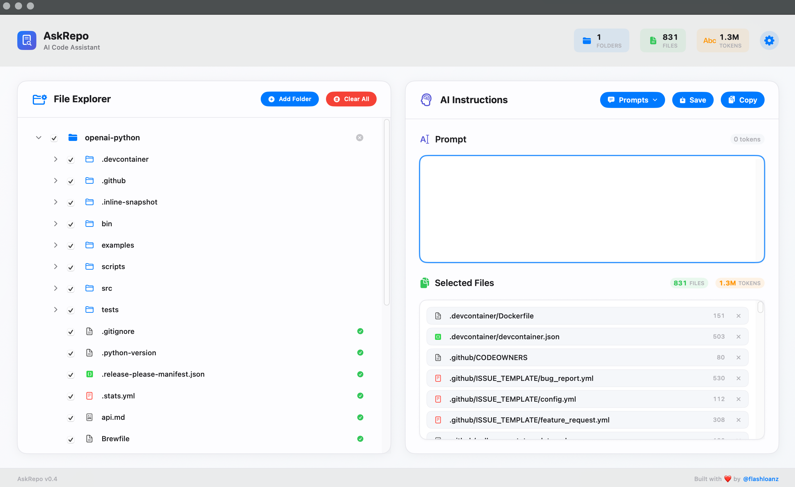

# 🤖 AskRepo - AI Code Assistant for macOS

<div align="center">


[](https://swift.org)
[](https://www.apple.com/macos)
[](LICENSE)

**A beautiful, modern macOS app that helps you prepare code for AI assistants**

[Download DMG](https://github.com/ninjiez/askrepo/releases/latest) • [Features](#-features) • [Install](#-installation) • [Contribute](#-contributing)

**If AskRepo helps your workflow, consider giving it a ⭐ and following me on X @ [@flashloanz](https://x.com/flashloanz)**.

</div>


## ✨ Features

AskRepo streamlines the process of sharing your codebase with AI assistants like ChatGPT, Claude, Gemini or Grok.
Instead of manually copying and pasting files, AskRepo provides an elegant solution:

### 🎯 **Smart File Selection**
- **Visual File Tree**: Navigate your project structure with an intuitive file explorer
- **Selective Inclusion**: Choose exactly which files to include using checkboxes
- **GitIgnore Aware**: Automatically respects `.gitignore` patterns

### 📊 **Token Management**
- **Real-time Token Counting**: See total tokens for your selection
- **Per-file Token Display**: Individual token counts for each selected file

### 🎨 **Beautiful Interface**
- **Modern Design**: Clean, native macOS design language
- **Smooth Animations**: Delightful interactions throughout

### 🚀 **Productivity Features**

- **Customizable Prompt Templates**: Save and reuse prompt templates for different AI assistants
- **One-Click Copy**: Copy formatted output directly to clipboard
- **Persistent Sessions**: Remembers your directory selections
- **Custom Prompts**: Add context and instructions for AI
- **Confirmation Dialogs**: Prevents accidental data loss

### 🔒 **Privacy First**
- **Local Processing**: All operations happen on your machine
- **No Network Calls**: Your code never leaves your computer
- **Open Source**: Full transparency in how your data is handled

---

## 📱 Screenshots

<div align="center">


*Main interface showing file selection and prompt composition*

</div>

---

## 💾 Installation

### Option 1: Download DMG

> **Note**: AskRepo is not code-signed because I don't have an Apple Developer account (it costs $99/year). I developed this app for personal use and decided to share it with the community. When you download it, macOS will show a security warning.

1. Download the latest [AskRepo.dmg](https://github.com/ninjiez/askrepo/releases/latest)
2. Open the DMG file
3. Drag AskRepo to your Applications folder
4. **Fix the security warning** by opening Terminal and running:
   ```bash
   cd /Applications
   xattr -dr com.apple.quarantine AskRepo.app
   ```
5. Launch AskRepo from Applications or Spotlight

Alternatively, if you prefer to build from source (which avoids the security warning), see Option 2 below.

### Option 2: Build from Source (No Security Warnings)

Building from source avoids all security warnings since the app runs locally without quarantine flags.

```bash
# Clone the repository
git clone https://github.com/ninjiez/askrepo.git
cd askrepo

# Build the app and create DMG
./build.sh        # Creates the .app bundle
./build-dmg.sh    # Creates the DMG installer

# Or run directly
swift run

# Or open in Xcode
open Package.swift
```

### Requirements
- **macOS 13.0** or later
- **Xcode 15.0** or later (for building from source)

---

## 🎯 How to Use

### 1. **Add Your Projects**
Click the **+** button to add project directories. AskRepo will:
- Load the complete file structure
- Respect `.gitignore` patterns  
- Auto-select relevant code files

### 2. **Select Files**
- ✅ Check files you want to include
- 📁 Select entire directories with one click
- 👁️ See real-time token counts

### 3. **Write Your Prompt**
Add context in the prompt section:
```markdown
Please review this React component and suggest improvements for:
- Performance optimization
- Code readability  
- TypeScript best practices
```

### 4. **Copy & Share**

Click **Copy** to get formatted output ready for your AI assistant:

```markdown
# Instructions

Please review this React component and suggest improvements...

# Selected Files

src/components/UserProfile.tsx
// Your code here...

src/hooks/useUser.ts
// More code...
```

## 🛠️ Contributing

We'd love your help making AskRepo even better! Here's how you can contribute:

### 🐛 **Report Issues**
Found a bug? [Open an issue](https://github.com/ninjiez/askrepo/issues) with:
- Clear description of the problem
- Steps to reproduce
- macOS version and AskRepo version
- Screenshots if applicable

### ✨ **Suggest Features**
Have an idea? [Send me a DM](https://x.com/flashloanz) or open a feature request!

### 🔧 **Submit Code**
1. Fork the repository
2. Create a feature branch: `git checkout -b amazing-feature`
3. Make your changes
4. Add tests if applicable
5. Submit a pull request

### 📋 **Development Setup**
```bash
git clone https://github.com/ninjiez/askrepo.git
cd askrepo
swift build
```

**Code Style**: We follow Swift conventions and use SwiftUI best practices.

---

## 🏗️ Architecture

AskRepo is built with modern Swift technologies:

- **SwiftUI**: Declarative UI framework
- **Swift Package Manager**: Dependency management
- **Foundation**: File system operations
- **AppKit**: Native macOS integration

## 📈 TODO

- [ ] **Dark Mode**: Switch between light & dark mode
- [ ] **LLM API Integration**: Directly send output to your chosen LLM API.
- [ ] **Plugin System**: Extensible architecture
- [ ] **Windows/Linux**: Cross-platform support
- [ ] **Prompt Prefix/Rules**: Add rules that will be added to all prompts.

## 💬 Community & Support

### 🐦 **Follow & Connect**
- **Twitter/X**: [@flashloanz](https://x.com/flashloanz) - Follow for updates, tips, and support!
- **GitHub**: Star ⭐ this repo if you find it useful

### 🤝 **Get Involved**
- **Share**: Tell other developers about AskRepo
- **Feedback**: Reach out on X with suggestions
- **Contribute**: Check out [good first issues](https://github.com/ninjiez/askrepo/labels/good%20first%20issue)

## 📄 License

AskRepo is open source software licensed under the [MIT License](LICENSE).

```
Copyright (c) 2025 @flashloanz

Permission is hereby granted, free of charge, to any person obtaining a copy
of this software and associated documentation files (the "Software"), to deal
in the Software without restriction, including without limitation the rights
to use, copy, modify, merge, publish, distribute, sublicense, and/or sell
copies of the Software...
```

<p align="center">

### Made with ❤️ by [@flashloanz](https://x.com/flashloanz)

If AskRepo helps your workflow, consider giving it a ⭐ and following [@flashloanz](https://x.com/flashloanz).

[⬆ Back to Top](#-askrepo---ai-code-assistant-for-macos)

</p>
